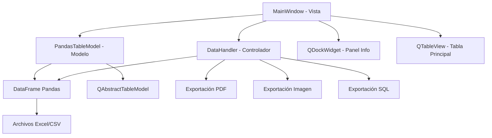

# Plan de Desarrollo Detallado: Flash View Sheet

## Proyecto: flash-view-sheet
**Descripción:** Aplicación de escritorio para visualización y análisis de datos tabulares (Excel, CSV)

---

## 1. Visión General y Objetivos

### 1.1 Objetivo Principal
Crear un visor de datos ligero y eficiente que permita:
- Abrir archivos .xlsx, .xls, y .csv
- Ver resumen inmediato de la estructura de datos
- Obtener estadísticas descriptivas básicas
- Visualizar datos en tabla interactiva
- Realizar operaciones simples (filtrado y búsqueda)
- Exportar vista actual a formatos comunes (PDF, Imagen, SQL)

### 1.2 Características Clave
- Interfaz gráfica moderna con PySide6
- Carga rápida de archivos tabulares
- Análisis estadístico automático
- Interfaz intuitiva y responsive

---

## 2. Stack Tecnológico

### 2.1 Lenguajes y Frameworks
- **Lenguaje:** Python 3.10+
- **GUI:** PySide6 (binding oficial de Qt para Python)
- **Análisis de Datos:** Pandas
- **Lectura Excel:** openpyxl
- **Exportación SQL:** SQLAlchemy
- **Exportación PDF:** reportlab

---

## 3. Arquitectura del Sistema

### 3.1 Patrón MVC (Modelo-Vista-Controlador)



### 3.2 Estructura de Directorios
```
/flash-view-sheet/
├── main.py                    # Punto de entrada principal
├── app/
│   ├── __init__.py
│   ├── main_window.py         # Ventana principal y controladores
│   ├── ui_main_window.ui       # Archivo de Qt Designer
│   ├── widgets/
│   │   ├── __init__.py
│   │    └── info_panel.py      # Panel de información y estadísticas
│    └── models/
│       ├── __init__.py
│        └── pandas_model.py     # Modelo para conectar Pandas con QTableView
├── core/
│   ├── __init__.py
│    └── data_handler.py        # Lógica de manejo de datos
├── docs/
│   ├── plan.md                  # Este documento
│    └── avances.md                # Registro de progreso
└── requirements.txt             # Dependencias del proyecto
```

---

## 4. Fases de Desarrollo Detalladas

### Fase 0: Configuración del Entorno de Desarrollo

#### Subfase 0.1: Estructura Inicial del Proyecto
- [ ] Crear directorio raíz `/flash-view-sheet`
- [ ] Crear estructura de subdirectorios
- [ ] Inicializar archivos `__init__.py`
- [ ] Crear `requirements.txt` con dependencias
- [ ] Configurar entorno virtual Python
- [ ] Verificar instalación de PySide6

#### Subfase 0.2: Dependencias y Configuración
- [ ] Instalar PySide6: `pip install pyside6`
- [ ] Instalar Pandas: `pip install pandas`
- [ ] Instalar openpyxl: `pip install openpyxl`
- [ ] Instalar SQLAlchemy: `pip install sqlalchemy`
- [ ] Instalar reportlab: `pip install reportlab`
- [ ] Crear archivo `main.py` básico
- [ ] Verificar que la aplicación se ejecuta sin errores

### Fase 1: Carga de Archivos y Visualización Básica

#### Subfase 1.1: Interfaz de Usuario Principal
- [ ] Diseñar MainWindow con Qt Designer
- [ ] Implementar QMenuBar con menú "Archivo"
- [ ] Crear acción "Abrir..." en el menú
- [ ] Añadir QTableView central
- [ ] Configurar layout principal

#### Subfase 1.2: Lógica de Carga de Datos
- [ ] Implementar función `cargar_datos(filepath)` en `data_handler.py`
- [ ] Manejar diferentes formatos (.xlsx, .xls, .csv)
- [ ] Implementar manejo de errores con try...except
- [ ] Mostrar mensajes de error con QMessageBox

#### Subfase 1.3: Modelo de Datos
- [ ] Crear clase `PandasTableModel(QAbstractTableModel)`
- [ ] Implementar método `rowCount()` 
- [ ] Implementar método `columnCount()`
- [ ] Implementar método `data(index, role)`
- [ ] Implementar método `headerData(section, orientation, role)`

### Fase 2: Panel de Información y Estadísticas

#### Subfase 2.1: Widget de Información
- [ ] Crear clase `InfoPanel` en `info_panel.py`
- [ ] Diseñar interfaz para mostrar metadata
- [ ] Mostrar número de filas y columnas
- [ ] Mostrar nombres y tipos de columnas

#### Subfase 2.2: Análisis Estadístico
- [ ] Implementar extracción de estadísticas con `df.describe()`
- [ ] Formatear estadísticas para visualización
- [ ] Conectar actualización de estadísticas con carga de datos

### Fase 3: Operaciones de Filtrado y Búsqueda

#### Subfase 3.1: Interfaz de Filtrado
- [ ] Añadir QComboBox para selección de columnas
- [ ] Implementar QLineEdit para término de búsqueda
- [ ] Crear botones "Aplicar Filtro" y "Limpiar Filtro`
- [ ] Poblar ComboBox con nombres de columnas

#### Subfase 3.2: Lógica de Filtrado
- [ ] Implementar método `aplicar_filtro()`
- [ ] Implementar método `limpiar_filtro()`
- [ ] Manejar filtrado por texto con `str.contains()`

### Fase 4: Sistema de Exportación

#### Subfase 4.1: Exportación a PDF
- [ ] Implementar `exportar_a_pdf()` usando reportlab
- [ ] Crear SimpleDocTemplate
- [ ] Convertir DataFrame a formato tabla
- [ ] Aplicar estilos y formato al PDF

#### Subfase 4.2: Exportación a Imagen
- [ ] Implementar `exportar_a_imagen()` usando QPixmap.grab()

#### Subfase 4.3: Exportación a SQL
- [ ] Implementar `exportar_a_sql()`
- [ ] Usar SQLAlchemy para crear engine
- [ ] Implementar `to_sql()` de Pandas

### Fase 5: Optimización y Mejoras

#### Subfase 5.1: Manejo de Archivos Grandes
- [ ] Investigar implementación de paginación virtual
- [ ] Optimizar rendimiento para datasets extensos

---

## 5. Cronograma Estimado

### Fase 0: 1-2 días
### Fase 1: 3-5 días
### Fase 2: 2-3 días
### Fase 3: 2-4 días
### Fase 4: 3-5 días
### Fase 5: 2-3 días

**Total estimado:** 13-20 días de desarrollo

---

## 6. Criterios de Aceptación

### Funcionalidades Mínimas Viables (MVP)
- [ ] Cargar archivos Excel y CSV
- [ ] Mostrar datos en tabla
- [ ] Panel básico de información
- [ ] Filtrado simple por texto
- [ ] Exportación básica a PDF e imagen

### Funcionalidades Avanzadas
- [ ] Exportación a SQL
- [ ] Manejo optimizado de archivos grandes
- [ ] Interfaz completamente funcional

---

## 7. Consideraciones Técnicas

### 7.1 Rendimiento
- Implementar carga lazy para datasets grandes
- Considerar paginación virtual en QTableView
- Implementar hilos para operaciones largas

### 7.2 Manejo de Errores
- try...except para operaciones de archivo
- Validación de tipos de datos
- Manejo de archivos corruptos

### 7.3 Usabilidad
- Interfaz intuitiva
- Mensajes de error claros
- Feedback visual durante operaciones

---

## 8. Próximos Pasos

1. **Aprobación del plan** - Revisión y ajustes
2. **Inicio Fase 0** - Configuración del entorno
3. **Desarrollo iterativo** - Seguir fases secuencialmente
4. **Pruebas y validación** - Verificar cada funcionalidad
5. **Documentación final** - Completar guías de usuario