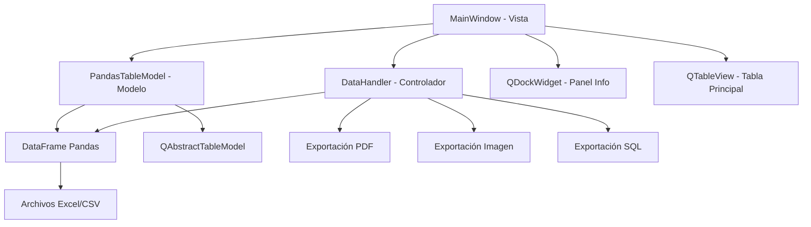

# Plan de Desarrollo Detallado: Flash View Sheet

## Proyecto: flash-view-sheet
**Descripción:** Aplicación de escritorio para visualización y análisis de datos tabulares (Excel, CSV)

---

## 1. Visión General y Objetivos

### 1.1 Objetivo Principal
Crear un visor de datos ligero y eficiente que permita:
- Abrir archivos .xlsx, .xls, y .csv
- Ver resumen inmediato de la estructura de datos
- Obtener estadísticas descriptivas básicas
- Visualizar datos en tabla interactiva
- Realizar operaciones simples (filtrado y búsqueda)
- Exportar vista actual a formatos comunes (PDF, Imagen, SQL)

### 1.2 Características Clave
- Interfaz gráfica moderna con PySide6
- Carga rápida de archivos tabulares
- Análisis estadístico automático
- Interfaz intuitiva y responsive

---

## 2. Stack Tecnológico

### 2.1 Lenguajes y Frameworks
- **Lenguaje:** Python 3.10+
- **GUI:** PySide6 (binding oficial de Qt para Python)
- **Análisis de Datos:** Pandas
- **Lectura Excel:** openpyxl
- **Exportación SQL:** SQLAlchemy
- **Exportación PDF:** reportlab

---

## 3. Arquitectura del Sistema

### 3.1 Patrón MVC (Modelo-Vista-Controlador)



### 3.2 Estructura de Directorios
```
/flash-view-sheet/
├── main.py                    # Punto de entrada principal
├── app/
│   ├── __init__.py
│   ├── main_window.py         # Ventana principal y controladores
│   ├── ui_main_window.ui       # Archivo de Qt Designer
│   ├── widgets/
│   │   ├── __init__.py
│   │    └── info_panel.py      # Panel de información y estadísticas
│    └── models/
│       ├── __init__.py
│        └── pandas_model.py     # Modelo para conectar Pandas con QTableView
├── core/
│   ├── __init__.py
│    └── data_handler.py        # Lógica de manejo de datos
├── docs/
│   ├── plan.md                  # Este documento
│    └── avances.md                # Registro de progreso
└── requirements.txt             # Dependencias del proyecto
```

---

## 4. Fases de Desarrollo Detalladas

### Fase 0: Configuración del Entorno de Desarrollo

#### Subfase 0.1: Estructura Inicial del Proyecto
- [ ] Crear directorio raíz `/flash-view-sheet`
- [ ] Crear estructura de subdirectorios
- [ ] Inicializar archivos `__init__.py`
- [ ] Crear `requirements.txt` con dependencias
- [ ] Configurar entorno virtual Python
- [ ] Verificar instalación de PySide6

#### Subfase 0.2: Dependencias y Configuración
- [ ] Instalar PySide6: `pip install pyside6`
- [ ] Instalar Pandas: `pip install pandas`
- [ ] Instalar openpyxl: `pip install openpyxl`
- [ ] Instalar SQLAlchemy: `pip install sqlalchemy`
- [ ] Instalar reportlab: `pip install reportlab`
- [ ] Crear archivo `main.py` básico
- [ ] Verificar que la aplicación se ejecuta sin errores

### Fase 1: Carga de Archivos y Visualización Básica

#### Subfase 1.1: Interfaz de Usuario Principal
- [ ] Diseñar MainWindow con Qt Designer
- [ ] Implementar QMenuBar con menú "Archivo"
- [ ] Crear acción "Abrir..." en el menú
- [ ] Añadir QTableView central
- [ ] Configurar layout principal

#### Subfase 1.2: Lógica de Carga de Datos
- [ ] Implementar función `cargar_datos(filepath)` en `data_handler.py`
- [ ] Manejar diferentes formatos (.xlsx, .xls, .csv)
- [ ] Implementar manejo de errores con try...except
- [ ] Mostrar mensajes de error con QMessageBox

#### Subfase 1.3: Modelo de Datos
- [ ] Crear clase `PandasTableModel(QAbstractTableModel)`
- [ ] Implementar método `rowCount()` 
- [ ] Implementar método `columnCount()`
- [ ] Implementar método `data(index, role)`
- [ ] Implementar método `headerData(section, orientation, role)`

### Fase 2: Panel de Información y Estadísticas

#### Subfase 2.1: Widget de Información
- [ ] Crear clase `InfoPanel` en `info_panel.py`
- [ ] Diseñar interfaz para mostrar metadata
- [ ] Mostrar número de filas y columnas
- [ ] Mostrar nombres y tipos de columnas

#### Subfase 2.2: Análisis Estadístico
- [ ] Implementar extracción de estadísticas con `df.describe()`
- [ ] Formatear estadísticas para visualización
- [ ] Conectar actualización de estadísticas con carga de datos

### Fase 3: Operaciones de Filtrado y Búsqueda

#### Subfase 3.1: Interfaz de Filtrado
- [ ] Añadir QComboBox para selección de columnas
- [ ] Implementar QLineEdit para término de búsqueda
- [ ] Crear botones "Aplicar Filtro" y "Limpiar Filtro`
- [ ] Poblar ComboBox con nombres de columnas

#### Subfase 3.2: Lógica de Filtrado
- [ ] Implementar método `aplicar_filtro()`
- [ ] Implementar método `limpiar_filtro()`
- [ ] Manejar filtrado por texto con `str.contains()`

### Fase 4: Sistema de Exportación

#### Subfase 4.1: Exportación a PDF
- [ ] Implementar `exportar_a_pdf()` usando reportlab
- [ ] Crear SimpleDocTemplate
- [ ] Convertir DataFrame a formato tabla
- [ ] Aplicar estilos y formato al PDF

#### Subfase 4.2: Exportación a Imagen
- [ ] Implementar `exportar_a_imagen()` usando QPixmap.grab()

#### Subfase 4.3: Exportación a SQL
- [ ] Implementar `exportar_a_sql()`
- [ ] Usar SQLAlchemy para crear engine
- [ ] Implementar `to_sql()` de Pandas

### Fase 5: Optimización y Mejoras - COMPLETADA

#### Subfase 5.1: Manejo de Archivos Grandes
- [x] Implementar paginación virtual para datasets > 5000 filas
- [x] Optimizar rendimiento para datasets extensos con cache inteligente
- [x] Carga por chunks para archivos CSV/Excel grandes (>100MB)
- [x] Configuración adaptativa de parámetros de optimización

#### Subfase 5.2: Optimización de Estadísticas
- [x] Implementar lazy loading de estadísticas con sampling
- [x] Estadísticas aproximadas para datasets > 100k filas
- [x] Cálculo eficiente de métricas de rendimiento y memoria

#### Subfase 5.3: Optimización de Filtrado
- [x] Filtrado indexado para datasets > 50k filas
- [x] Soporte para expresiones regulares y wildcards
- [x] Búsqueda case-insensitive optimizada

#### Subfase 5.4: Sistema de Configuración y Testing
- [x] Archivo de configuración con parámetros de optimización
- [x] Configuración por variables de entorno
- [x] Suite completa de pruebas unitarias
- [x] Cobertura de tests para funciones críticas

### Fase 6: Visualizaciones y Funcionalidades Avanzadas (Planificada)

#### Subfase 6.1: Gráficos y Visualizaciones
- [ ] Implementar gráficos básicos (histogramas, scatter plots)
- [ ] Visualización de estadísticas descriptivas
- [ ] Gráficos de distribución y correlación

#### Subfase 6.2: Transformaciones de Datos
- [ ] Operaciones de limpieza de datos
- [ ] Transformaciones básicas (agregación, pivoteo)
- [ ] Manejo de tipos de datos y formatos

#### Subfase 6.3: Formatos de Archivo Adicionales
- [ ] Soporte para archivos JSON
- [ ] Lectura de archivos XML
- [ ] Conectores para bases de datos

---

## 5. Cronograma Actualizado

### Fase 0: 1-2 días ✅ Completada
### Fase 1: 3-5 días ✅ Completada
### Fase 2: 2-3 días ✅ Completada
### Fase 3: 2-4 días ✅ Completada
### Fase 4: 3-5 días ✅ Completada
### Fase 5: 2-3 días ✅ Completada

**Total completado:** 13-20 días de desarrollo
**Próxima fase (Fase 6):** 5-7 días estimados (Visualizaciones)

---

## 6. Criterios de Aceptación

### Funcionalidades Mínimas Viables (MVP)
- [ ] Cargar archivos Excel y CSV
- [ ] Mostrar datos en tabla
- [ ] Panel básico de información
- [ ] Filtrado simple por texto
- [ ] Exportación básica a PDF e imagen

### Funcionalidades Avanzadas - COMPLETADAS
- [x] Exportación a SQL
- [x] Manejo optimizado de archivos grandes con paginación virtual
- [x] Interfaz completamente funcional con optimizaciones
- [x] Paginación virtual para datasets > 5000 filas
- [x] Carga por chunks para archivos > 100MB
- [x] Estadísticas con sampling para datasets grandes
- [x] Filtrado indexado optimizado
- [x] Sistema de configuración y pruebas unitarias

### Funcionalidades Futuras (Fase 6)
- [ ] Gráficos y visualizaciones de datos
- [ ] Transformaciones y limpieza de datos
- [ ] Soporte para más formatos de archivo
- [ ] Conectores a bases de datos

---

## 7. Consideraciones Técnicas

### 7.1 Rendimiento - IMPLEMENTADO
- ✅ **Paginación Virtual**: Implementada para datasets > 5000 filas con cache inteligente
- ✅ **Carga por Chunks**: Archivos grandes se cargan en fragmentos optimizando memoria
- ✅ **Estadísticas con Sampling**: Cálculo eficiente usando muestras para datasets > 100k filas
- ✅ **Filtrado Indexado**: Búsqueda optimizada para datasets > 50k filas
- ✅ **Hilos Asíncronos**: Operaciones de carga en background para mantener UI responsiva

### 7.2 Manejo de Errores - IMPLEMENTADO
- ✅ try...except para operaciones de archivo con mensajes específicos
- ✅ Validación de tipos de datos y formatos de archivo
- ✅ Manejo de archivos corruptos con recuperación graceful
- ✅ Validación de parámetros en funciones de exportación

### 7.3 Usabilidad - IMPLEMENTADO
- ✅ Interfaz intuitiva con optimizaciones visuales
- ✅ Mensajes de error claros y feedback informativo
- ✅ Indicadores de progreso para operaciones largas
- ✅ Configuración automática de optimizaciones con mensajes al usuario
- ✅ Suite completa de pruebas unitarias para estabilidad

### 7.4 Configuración de Optimización
```python
# Configuración automática basada en tamaño del dataset
VIRTUALIZATION_THRESHOLD = 5000    # Paginación virtual
CHUNK_LOADING_THRESHOLD = 100MB    # Carga por chunks
STATS_SAMPLE_THRESHOLD = 100000    # Estadísticas con sampling
FILTER_OPTIMIZATION_THRESHOLD = 50000  # Filtrado indexado

# Configuración de cache y memoria
DEFAULT_CHUNK_SIZE = 1000          # Filas por chunk
MAX_CACHE_CHUNKS = 10              # Chunks en cache
```

---

## 8. Próximos Pasos

### Estado Actual: FASES 0-5 COMPLETADAS ✅
1. **Revisión de optimizaciones** - Validar rendimiento con datasets grandes
2. **Inicio Fase 6** - Visualizaciones y funcionalidades avanzadas
3. **Pruebas de integración** - Verificar estabilidad del sistema completo
4. **Documentación final** - Completar guías de usuario y API
5. **Release 1.0** - Preparar versión de producción

### Fase 6 Planificada: Visualizaciones y Análisis Avanzado
1. **Implementar gráficos básicos** - Histogramas, scatter plots, box plots
2. **Visualización de estadísticas** - Gráficos de distribución y correlación
3. **Transformaciones de datos** - Operaciones de limpieza y agregación
4. **Nuevos formatos** - Soporte para JSON, XML y conectores DB
5. **Interfaz avanzada** - Configuración y personalización de visualizaciones