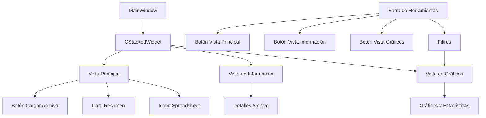

# Plan para Separar Vistas en la Aplicación Flash-Sheet

## Introducción
El objetivo es refactorizar la interfaz de usuario de la aplicación para separar las vistas en tres componentes principales, invocados desde la barra de herramientas. Esto mejorará la organización y usabilidad.

## Estado Actual
- La aplicación usa PySide6 con una ventana principal que incluye:
  - Una tabla central para datos.
  - Panel de información (dock widget) con detalles del archivo y estadísticas.
  - Panel de visualizaciones (dock widget) para gráficos.
  - Barra de herramientas con filtros.
- Los datos se cargan y filtran, actualizando la tabla y paneles.

## Arquitectura Propuesta
- Usar un `QStackedWidget` en la ventana principal para alternar entre vistas.
- Vistas:
  1. **Vista Principal**: Botón para cargar archivo, card con resumen, icono de spreadsheet genérico.
  2. **Vista de Información**: Modal o vista dedicada para detalles del archivo (nombre, filas, columnas, tipos).
  3. **Vista de Gráficos**: Panel para visualizaciones y estadísticas, basado en datos filtrados.
- Botones en la barra de herramientas para cambiar vistas.
- Mantener filtros en la barra, aplicables a la vista de gráficos.

## Diagrama de Arquitectura

## Lista de Tareas
- [ ] Analizar estructura UI actual y componentes
- [ ] Diseñar arquitectura de vistas con stacked widgets
- [ ] Crear widget de vista principal con botón de carga, card e icono
- [ ] Crear modal de información para detalles del archivo
- [ ] Crear widget de vista de gráficos para charts y stats
- [ ] Actualizar barra de herramientas con botones para cambiar vistas
- [ ] Integrar vistas en MainWindow y manejar cambios
- [ ] Actualizar manejo de datos para aplicar filtros a vista de gráficos
- [ ] Probar el sistema de vistas y refinar

## Consideraciones
- Asegurar que los filtros se apliquen correctamente a la vista de gráficos.
- Mantener compatibilidad con funcionalidades existentes como exportación.
- Usar hilos para operaciones pesadas en gráficos.

¿Estás de acuerdo con este plan? ¿Hay cambios que quieras hacer?