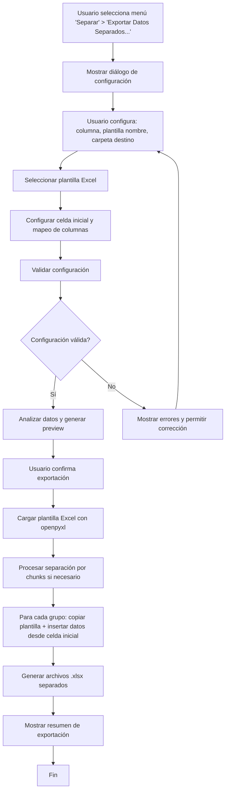

# Plan de Implementación: Exportación de Datos Separados por Columna con Plantillas Excel

## Fase 1: Análisis y Diseño de Requerimientos

### Subfase 1.1: Definición de Funcionalidades
- **Objetivo**: Especificar claramente las características de la nueva funcionalidad de exportación separada usando plantillas Excel.
- **Tareas**:
  - Identificar columna de separación (selección por usuario).
  - Permitir personalización de nombres de archivos (plantillas con placeholders).
  - Selección de carpeta de destino.
  - **Solo formato Excel**: Usar plantillas Excel existentes sin modificar formato.
  - Inserción de datos a partir de celda específica (configurable).
  - Mapeo de columnas DataFrame a columnas Excel.
  - Validación de datos antes de la separación.
  - Manejo de errores para valores nulos o inválidos en columna de separación.

### Subfase 1.2: Análisis de Impacto en la Arquitectura
- **Objetivo**: Evaluar cómo integrar la nueva funcionalidad en la aplicación existente.
- **Tareas**:
  - Revisar estructura actual de exportación en `core/data_handler.py`.
  - **Crear nueva sección "Separar" en el menú superior** de `main.py`.
  - Evaluar compatibilidad con sistema de loaders existente.
  - Considerar optimización para datasets grandes (chunking, memoria).
  - **Investigación de librerías**: Evaluar openpyxl vs otras librerías que preserven formato.

### Subfase 1.3: Diseño de Interfaz de Usuario
- **Objetivo**: Diseñar la UI para configurar la exportación separada con plantillas Excel.
- **Tareas**:
  - Crear diálogo modal para configuración de separación.
  - Campos: selección de columna, plantilla de nombre de archivo, selección de carpeta.
  - **Selección de plantilla Excel**: Diálogo para elegir archivo plantilla.
  - **Configuración de celda inicial**: Especificar celda donde insertar datos (ej: A5).
  - **Mapeo de columnas**: Interfaz para mapear columnas DataFrame a columnas Excel.
  - Preview de nombres de archivos generados.
  - Opciones avanzadas: manejo de duplicados, sobrescritura de archivos.

## Fase 2: Diseño Técnico

### Subfase 2.1: Arquitectura de la Solución
- **Objetivo**: Definir la estructura técnica de la implementación con plantillas Excel.
- **Componentes principales**:
  - `ExcelTemplateSplitter` class en `core/data_handler.py` para lógica de separación con plantillas.
  - `ExportSeparatedDialog` widget en `app/widgets/` para UI.
  - Integración con menú de exportación en `main.py`.
  - **Uso de openpyxl**: Librería que preserva formato Excel sin modificarlo.
  - Sistema de mapeo columna DataFrame -> columna Excel.

### Subfase 2.2: Diseño de Algoritmos
- **Objetivo**: Especificar algoritmos para separación eficiente con plantillas Excel.
- **Algoritmos**:
  - Agrupación por valores únicos de columna seleccionada.
  - Generación de nombres de archivos con plantillas (ej: "{valor}_{fecha}.xlsx").
  - **Carga de plantilla Excel**: Copia de archivo plantilla sin modificar formato.
  - **Inserción de datos**: Escritura en celdas específicas preservando formato.
  - **Mapeo de columnas**: Conversión de índices DataFrame a referencias Excel (A, B, C...).
  - Validación de nombres de archivos (caracteres inválidos, longitud).
  - Optimización para memoria con procesamiento por chunks.

### Subfase 2.3: Manejo de Casos Especiales
- **Objetivo**: Definir comportamiento para situaciones complejas con Excel.
- **Casos**:
  - Valores nulos en columna de separación.
  - Nombres de archivos duplicados.
  - Límites de sistema operativo en nombres de archivos.
  - **Plantillas Excel corruptas o inexistentes**.
  - **Conflictos de mapeo**: Columnas DataFrame sin correspondencia en Excel.
  - **Celdas ocupadas**: Manejo cuando la celda inicial ya tiene datos.
  - Datasets muy grandes que requieren chunking.

## Fase 3: Implementación

### Subfase 3.1: Desarrollo del Core (ExcelTemplateSplitter)
- **Objetivo**: Implementar la lógica central de separación de datos con plantillas Excel.
- **Tareas**:
  - Crear clase `ExcelTemplateSplitter` con métodos para análisis y separación.
  - Implementar validación de parámetros (plantilla existe, celda válida).
  - Desarrollar algoritmos de agrupación y exportación con openpyxl.
  - **Implementar mapeo DataFrame -> Excel**: Conversión de columnas.
  - **Preservar formato Excel**: Solo insertar datos sin modificar estilos.
  - Agregar soporte para celda inicial configurable.

### Subfase 3.2: Desarrollo de la Interfaz
- **Objetivo**: Crear la UI para configuración de exportación con plantillas Excel.
- **Tareas**:
  - Implementar `ExportSeparatedDialog` con PySide6.
  - **Selector de plantilla Excel**: Diálogo para elegir archivo .xlsx.
  - **Configurador de celda inicial**: Input para coordenada (ej: "A5").
  - **Interfaz de mapeo**: Tabla para mapear columnas DataFrame a letras Excel.
  - Conectar señales para validación en tiempo real.
  - Agregar preview de archivos a generar.
  - Integrar con sistema de selección de carpetas.

### Subfase 3.3: Integración con la Aplicación
- **Objetivo**: Conectar la nueva funcionalidad con el flujo principal.
- **Tareas**:
  - **Crear nueva sección "Separar" en el menú superior** de `main.py`.
  - Agregar opción "Exportar Datos Separados..." en el menú Separar.
  - Conectar señales entre dialog y lógica de exportación.
  - Actualizar status bar con progreso de exportación.
  - Manejar errores específicos de Excel (plantilla corrupta, permisos).
  - Mostrar mensajes al usuario sobre archivos generados.

### Subfase 3.4: Optimizaciones de Rendimiento
- **Objetivo**: Asegurar eficiencia en datasets grandes con Excel.
- **Tareas**:
  - Implementar procesamiento por chunks para separación.
  - **Optimización openpyxl**: Carga eficiente de plantillas grandes.
  - Agregar indicadores de progreso detallados.
  - Optimizar uso de memoria (no cargar toda plantilla en RAM).
  - Soporte para cancelación de operaciones largas.

## Fase 4: Testing y Validación

### Subfase 4.1: Desarrollo de Tests Unitarios
- **Objetivo**: Validar componentes individuales.
- **Tareas**:
  - Tests para `DataSplitter` con diferentes tipos de datos.
  - Tests para generación de nombres de archivos.
  - Tests para validación de parámetros.
  - Tests de integración con formatos de exportación existentes.

### Subfase 4.2: Testing de Integración
- **Objetivo**: Validar funcionamiento end-to-end.
- **Tareas**:
  - Tests de UI con diferentes configuraciones.
  - Tests con datasets reales de diferentes tamaños.
  - Validación de archivos generados.
  - Tests de manejo de errores.

### Subfase 4.3: Testing de Rendimiento
- **Objetivo**: Validar escalabilidad.
- **Tareas**:
  - Benchmarks con datasets grandes.
  - Medición de uso de memoria.
  - Tests de concurrencia si aplica.
  - Optimizaciones basadas en resultados.

## Fase 5: Documentación y Despliegue

### Subfase 5.1: Documentación Técnica
- **Objetivo**: Documentar la nueva funcionalidad.
- **Tareas**:
  - Actualizar README con nueva feature.
  - Documentar API de `DataSplitter`.
  - Crear ejemplos de uso.
  - Actualizar documentación de formatos soportados.

### Subfase 5.2: Documentación de Usuario
- **Objetivo**: Guiar a usuarios en el uso de la funcionalidad.
- **Tareas**:
  - Tutorial paso a paso.
  - Ejemplos prácticos.
  - FAQ para casos comunes.
  - Screenshots de la interfaz.

### Subfase 5.3: Preparación para Release
- **Objetivo**: Asegurar calidad antes del despliegue.
- **Tareas**:
  - Code review final.
  - Testing en diferentes entornos.
  - Actualización de versionado.
  - Preparación de changelog.

## Diagrama de Flujo General

## Consideraciones Técnicas

- **Compatibilidad**: Mantener consistencia con sistema de loaders existente.
- **Librería Excel**: Usar openpyxl para preservar formato sin modificaciones.
- **Mapeo de Columnas**: Sistema flexible DataFrame -> coordenadas Excel.
- **Usabilidad**: Interfaz intuitiva con validación en tiempo real.
- **Rendimiento**: Optimizaciones para datasets de hasta 10M+ filas.
- **Seguridad**: Validación de paths, nombres de archivos y plantillas Excel.

## Métricas de Éxito

- Tiempo de exportación < 3x tiempo de exportación normal (debido a plantillas).
- Formato Excel preservado al 100% (sin cambios en estilos, fórmulas, etc.).
- Interfaz usable por usuarios no técnicos.
- Cobertura de tests > 90%.
- Sin regresiones en funcionalidades existentes.
- Soporte para plantillas Excel complejas con múltiples hojas.