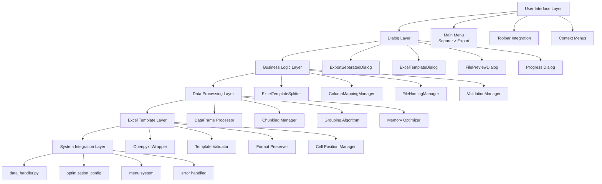

# SUBFASE 2.1: ARQUITECTURA DE LA SOLUCIÓN
## Diseño de Arquitectura para Exportación de Datos Separados con Plantillas Excel

### 📋 Objetivo
Definir la estructura técnica completa para implementar la funcionalidad de separación de datos con plantillas Excel, integrando seamlessly con la arquitectura existente de Flash View Sheet.

### 🏗️ Arquitectura General

#### **Diagrama de Componentes**


### 🧩 Componentes Principales

#### **1. ExcelTemplateSplitter Class** (Core Business Logic)

**Ubicación**: `core/data_handler.py` (extensión de funciones existentes)

**Responsabilidades**:
- Orquestar todo el proceso de separación
- Integrar con optimization_config para rendimiento
- Manejar chunking para datasets grandes
- Gestionar progreso y cancelación
- Mantener logging detallado

**Interfaz Pública**:
```python
class ExcelTemplateSplitter:
    def __init__(self, df: pd.DataFrame, config: ExportSeparatedConfig):
        """Inicializar con DataFrame y configuración"""
        self.df = df
        self.config = config
        self.progress_callback = None
        self.cancellation_token = CancellationToken()
        
    def validate_configuration(self) -> ValidationResult:
        """Validar configuración completa antes de proceder"""
        
    def analyze_data(self) -> DataAnalysisResult:
        """Analizar DataFrame para generar preview y validar separación"""
        
    def separate_and_export(self) -> ExportResult:
        """Ejecutar separación completa y exportación"""
        
    def process_chunk(self, chunk_df: pd.DataFrame) -> ExportResult:
        """Procesar chunk específico para datasets grandes"""
        
    def cancel_operation(self):
        """Cancelar operación en curso"""
```

**Integración con Funciones Existentes**:
- Sigue patrón `function(df, filepath/params) -> bool`
- Reutiliza `optimization_config` para chunking thresholds
- Compatible con sistema de logging existente
- Manejo de errores consistente con `exportar_a_pdf`, `exportar_a_sql`

#### **2. ExportSeparatedDialog Class** (User Interface)

**Ubicación**: `app/widgets/export_separated_dialog.py` (nuevo archivo)

**Responsabilidades**:
- UI principal para configuración de separación
- Validación en tiempo real
- Preview dinámico de archivos
- Integración con proceso de exportación
- Persistencia de configuraciones

**Componentes UI**:
```python
class ExportSeparatedDialog(QDialog):
    def __init__(self, parent=None):
        self.setup_ui()
        self.setup_connections()
        self.setup_validation()
        
    def setup_ui(self):
        """Configurar interfaz completa con 5 secciones"""
        # 1. SectionSelector (Datos de origen)
        # 2. TemplateConfig (Plantilla Excel y celda inicial)
        # 3. FileNaming (Nombres de archivo y placeholders)
        # 4. ColumnMapping (Mapeo DataFrame -> Excel)
        # 5. DestinationConfig (Carpeta destino y opciones)
        
    def validate_configuration(self):
        """Validación en tiempo real de todos los componentes"""
        
    def generate_preview(self):
        """Generar preview de archivos a crear"""
        
    def start_export_process(self):
        """Iniciar proceso de exportación con progreso"""
```

#### **3. ColumnMappingManager Class** (Mapping Logic)

**Ubicación**: `app/widgets/column_mapping_manager.py` (nuevo archivo)

**Responsabilidades**:
- Gestionar mapeo flexible de columnas DataFrame ↔ Excel
- Proporcionar presets automáticos
- Validar compatibilidad de tipos de datos
- Interface para mapeo manual

**Componentes**:
```python
class ColumnMappingManager(QWidget):
    def __init__(self, df_columns: List[str], excel_columns: List[str]):
        self.df_columns = df_columns
        self.excel_columns = excel_columns
        self.mapping_config = ColumnMappingConfig()
        
    def auto_map_positional(self) -> Dict[str, str]:
        """Mapeo automático por posición (1:1)"""
        
    def auto_map_by_name(self) -> Dict[str, str]:
        """Mapeo automático por nombre de columna"""
        
    def get_preset_mapping(self, preset_type: str) -> Dict[str, str]:
        """Obtener mapeo preset (ventas, reportes, científico)"""
        
    def validate_mapping(self) -> MappingValidationResult:
        """Validar mapeo antes de exportar"""
```

#### **4. FileNamingManager Class** (Naming Logic)

**Ubicación**: `core/data_handler.py` (extensión interna)

**Responsabilidades**:
- Procesar plantillas de nombres con placeholders
- Validar nombres de archivo del sistema operativo
- Generar nombres únicos para evitar conflictos
- Soporte para caracteres especiales

**Placeholders Soportados**:
```python
class FileNamingManager:
    PLACEHOLDER_TYPES = {
        '{valor}': 'Valor de columna de separación',
        '{columna}': 'Nombre de columna de separación',
        '{fecha}': 'Fecha actual (YYYY-MM-DD)',
        '{fecha_hora}': 'Fecha y hora (YYYY-MM-DD_HHMM)',
        '{filas}': 'Número de filas en el grupo',
        '{indice}': 'Índice del grupo (01, 02, 03...)'
    }
    
    def process_template(self, template: str, group_info: Dict) -> str:
        """Procesar plantilla con datos del grupo"""
        
    def sanitize_filename(self, filename: str) -> str:
        """Sanitizar nombre para compatibilidad del SO"""
        
    def resolve_conflicts(self, filenames: List[str]) -> List[str]:
        """Resolver conflictos de nombres duplicados"""
```

#### **5. ExcelTemplateManager Class** (Excel Logic)

**Ubicación**: `core/excel_template_handler.py` (nuevo archivo)

**Responsabilidades**:
- Wrapper para openpyxl con preservación de formato
- Validación de plantillas Excel
- Gestión de celda inicial y mapeo de columnas
- Optimización para plantillas grandes

**Componentes**:
```python
class ExcelTemplateManager:
    def __init__(self, template_path: str):
        self.template_path = template_path
        self.workbook = None
        self.format_cache = {}
        
    def load_template(self) -> bool:
        """Cargar plantilla con openpyxl preservando formato"""
        
    def validate_template(self) -> TemplateValidationResult:
        """Validar plantilla antes de usar"""
        
    def get_available_columns(self) -> List[str]:
        """Obtener columnas disponibles en plantilla"""
        
    def copy_template(self, output_path: str) -> bool:
        """Copiar plantilla a ubicación de destino"""
        
    def insert_data(self, df: pd.DataFrame, start_cell: str, 
                   column_mapping: Dict[str, str]) -> bool:
        """Insertar datos preservando formato existente"""
        
    def preserve_formatting(self, sheet_name: str):
        """Preservar formato original durante inserción"""
```

### 🔗 Integración con Sistema Existente

#### **1. Integración con Menús (main.py)**

**Modificación Mínima**:
```python
# En create_menu_bar():
# Agregar nuevo menú "Separar" al mismo nivel que "Archivo"

def create_menu_bar(self):
    menu_bar = self.menuBar()
    
    # ... menú Archivo existente ...
    
    # Nuevo menú "Separar"
    separar_menu = menu_bar.addMenu("&Separar")
    
    exportar_separado_action = separar_menu.addAction("&Exportar Datos Separados...")
    exportar_separado_action.setShortcut("Ctrl+Shift+S")
    exportar_separado_action.triggered.connect(self.exportar_datos_separados)
    
    # Nota: El menú "Separar" aparece cuando hay datos cargados
    # Se habilita/deshabilita dinámicamente
```

**Funcionalidad**:
- Menú "Separar" al mismo nivel jerárquico que "Archivo"
- Habilitado solo cuando hay DataFrame cargado
- Accesible via Ctrl+Shift+S para workflows frecuentes
- Integración con sistema de shortcuts existente

#### **2. Integración con data_handler.py**

**Nueva Función Export Principal**:
```python
def exportar_datos_separados(df: pd.DataFrame, config: dict) -> dict:
    """
    Exportar DataFrame a archivos Excel separados usando plantillas
    
    Args:
        df: DataFrame a separar
        config: Configuración completa de separación
            - separator_column: str
            - template_path: str  
            - start_cell: str (ej: 'A5')
            - output_folder: str
            - file_template: str
            - column_mapping: Dict[str, str]
            - handle_duplicates: str ('overwrite', 'append', 'skip')
    
    Returns:
        dict con resultado:
            - success: bool
            - files_created: List[str]
            - groups_processed: int
            - total_rows: int
            - processing_time: float
            - errors: List[str]
    """
    try:
        splitter = ExcelTemplateSplitter(df, config)
        result = splitter.separate_and_export()
        return {
            'success': True,
            'files_created': result.files_created,
            'groups_processed': result.groups_processed,
            'total_rows': result.total_rows,
            'processing_time': result.processing_time,
            'errors': []
        }
    except Exception as e:
        return {
            'success': False,
            'files_created': [],
            'groups_processed': 0,
            'total_rows': 0,
            'processing_time': 0.0,
            'errors': [str(e)]
        }
```

**Integración con Sistema de Optimización**:
```python
# En ExcelTemplateSplitter.__init__():
def __init__(self, df: pd.DataFrame, config: ExportSeparatedConfig):
    self.df = df
    self.config = config
    
    # Usar configuración de optimización existente
    if len(df) > optimization_config.VIRTUALIZATION_THRESHOLD:
        self.enable_chunking = True
        self.chunk_size = optimization_config.DEFAULT_CHUNK_SIZE
    else:
        self.enable_chunking = False
        self.chunk_size = len(df)
```

#### **3. Integración con Sistema de Progreso**

**Reutilización de QProgressDialog**:
```python
def mostrar_progress_separacion(self, total_groups: int):
    """Mostrar diálogo de progreso para separación"""
    self.progress_dialog = QProgressDialog(
        "Separando datos...",
        "Cancelar", 
        0, total_groups
    )
    self.progress_dialog.setWindowTitle("Exportando datos separados")
    self.progress_dialog.setWindowModality(Qt.WindowModal)
    self.progress_dialog.show()
    
    # Actualizar progreso durante procesamiento
    def update_progress(current_group, total_groups):
        self.progress_dialog.setValue(current_group)
        self.progress_dialog.setLabelText(
            f"Procesando grupo {current_group}/{total_groups}: {group_name}"
        )
```

### 📊 Configuración de Datos

#### **ExportSeparatedConfig Class** (Configuration Management)

**Ubicación**: `core/data_handler.py` (extensión)

**Estructura de Configuración**:
```python
@dataclass
class ExportSeparatedConfig:
    """Configuración completa para separación de datos"""
    
    # Datos de origen
    separator_column: str  # Columna para separar
    
    # Plantilla Excel
    template_path: str  # Ruta a plantilla .xlsx
    start_cell: str = "A1"  # Celda inicial para datos
    
    # Configuración de archivos
    output_folder: str  # Carpeta destino
    file_template: str = "{valor}.xlsx"  # Plantilla nombre archivo
    
    # Mapeo de columnas
    column_mapping: Dict[str, str] = field(default_factory=dict)
    # Ej: {'columna_df': 'A', 'otra_columna': 'C'}
    
    # Opciones avanzadas
    handle_duplicates: str = "overwrite"  # 'overwrite', 'append', 'skip'
    create_summary: bool = True  # Crear archivo resumen
    preserve_format: bool = True  # Preservar formato Excel
    
    # Opciones de rendimiento
    enable_chunking: bool = True  # Habilitar chunking automático
    max_memory_mb: int = 2048  # Límite de memoria
    progress_callback: Callable = None  # Callback de progreso
    
    def validate(self) -> ValidationResult:
        """Validar configuración completa"""
        
    def get_default_mapping(self, df_columns: List[str]) -> Dict[str, str]:
        """Obtener mapeo por defecto (posicional)"""
```

### 🎛️ Gestión de Rendimiento

#### **Chunking Strategy** (Optimización)

```python
class SeparationChunkManager:
    def __init__(self, df: pd.DataFrame, config: ExportSeparatedConfig):
        self.df = df
        self.config = config
        self.memory_threshold = optimization_config.MAX_MEMORY_MB * 1024 * 1024
        
    def should_use_chunking(self) -> bool:
        """Determinar si usar chunking basado en memoria"""
        estimated_memory = self.df.memory_usage(deep=True).sum()
        return estimated_memory > self.memory_threshold
        
    def get_optimal_chunk_size(self) -> int:
        """Calcular tamaño óptimo de chunk"""
        if not self.should_use_chunking():
            return len(self.df)
            
        # Usar configuración de optimización existente
        if len(self.df) > optimization_config.VIRTUALIZATION_THRESHOLD:
            return min(optimization_config.DEFAULT_CHUNK_SIZE, len(self.df) // 10)
        else:
            return min(10000, len(self.df) // 4)
            
    def process_by_groups_chunked(self) -> Iterator[ExportResult]:
        """Procesar grupos por chunks para gestión de memoria"""
        for group_name, group_df in self.df.groupby(self.config.separator_column):
            if len(group_df) > self.get_optimal_chunk_size():
                # Procesar grupo grande por chunks internos
                yield self._process_large_group_chunked(group_name, group_df)
            else:
                # Procesar grupo pequeño directamente
                yield self._process_small_group(group_name, group_df)
```

#### **Memory Management** (Gestión de Memoria)

```python
class MemoryOptimizedSplitter(ExcelTemplateSplitter):
    def __init__(self, df: pd.DataFrame, config: ExportSeparatedConfig):
        super().__init__(df, config)
        self.max_memory_mb = config.max_memory_mb
        self.memory_monitor = MemoryMonitor()
        
    def separate_and_export(self) -> ExportResult:
        """Separación con monitoreo de memoria"""
        self.memory_monitor.start()
        
        try:
            # Procesar por grupos
            groups = list(self.df.groupby(self.config.separator_column))
            total_memory = 0
            
            for group_name, group_df in groups:
                # Verificar memoria antes de procesar grupo
                if self.memory_monitor.get_usage_mb() > self.max_memory_mb * 0.8:
                    # Liberar memoria: garbage collection + cerrar workbooks
                    self._cleanup_memory()
                    
                # Procesar grupo
                result = self._export_group(group_name, group_df)
                total_memory += result.memory_used_mb
                
            return ExportResult(success=True, total_memory_used=total_memory)
            
        except MemoryError:
            raise ExportError("Dataset demasiado grande para memoria disponible")
        finally:
            self.memory_monitor.stop()
```

### 🔒 Manejo de Errores y Logging

#### **Error Handling Strategy** (Estrategia de Errores)

```python
class SeparationError(Exception):
    """Error base para separación de datos"""
    def __init__(self, message: str, error_code: str = None, details: dict = None):
        super().__init__(message)
        self.error_code = error_code
        self.details = details or {}

class TemplateError(SeparationError):
    """Error específico de plantilla Excel"""
    
class ConfigurationError(SeparationError):
    """Error de configuración inválida"""
    
class MemoryError(SeparationError):
    """Error de memoria insuficiente"""

# En ExcelTemplateSplitter:
def separate_and_export(self) -> ExportResult:
    """Ejecución con manejo robusto de errores"""
    try:
        # 1. Validar configuración
        validation = self.validate_configuration()
        if not validation.is_valid:
            raise ConfigurationError(f"Configuración inválida: {validation.errors}")
            
        # 2. Analizar datos
        analysis = self.analyze_data()
        if analysis.has_issues:
            self._log_warnings(analysis.warnings)
            
        # 3. Procesar separación
        results = []
        for group_name, group_df in self.df.groupby(self.config.separator_column):
            try:
                result = self._export_group(group_name, group_df)
                results.append(result)
                
                # Callback de progreso
                if self.progress_callback:
                    self.progress_callback(len(results), analysis.total_groups)
                    
            except Exception as e:
                # Continuar con otros grupos aunque uno falle
                error_result = ExportResult(
                    success=False, 
                    error=str(e), 
                    group_name=group_name
                )
                results.append(error_result)
                self._log_error(f"Error en grupo {group_name}: {e}")
                
        # 4. Generar resumen
        return self._generate_final_result(results)
        
    except Exception as e:
        self._log_error(f"Error crítico en separación: {e}")
        return ExportResult(success=False, error=str(e))
```

#### **Logging Integration** (Integración de Logging)

```python
import logging

# En ExcelTemplateSplitter:
def __init__(self, df: pd.DataFrame, config: ExportSeparatedConfig):
    self.logger = logging.getLogger(__name__)
    self._setup_logging()
    
def _setup_logging(self):
    """Configurar logging consistente con sistema existente"""
    self.logger.setLevel(logging.INFO)
    
def _log_info(self, message: str):
    """Log información (usado por sistema existente)"""
    self.logger.info(message)
    print(f"[INFO] {message}")  # Consistente con data_handler.py
    
def _log_error(self, message: str):
    """Log error con contexto"""
    self.logger.error(message)
    print(f"[ERROR] {message}")
    
def _log_warning(self, message: str):
    """Log warning para validaciones"""
    self.logger.warning(message)
    print(f"[WARNING] {message}")
```

### 🚀 Criterios de Diseño

#### **1. Reutilización de Patrones Existentes**
- ✅ Funciones export siguen patrón `function(df, params) -> result`
- ✅ Integración con `optimization_config` para consistencia
- ✅ Uso de `QProgressDialog` para consistencia UX
- ✅ Logging compatible con sistema actual
- ✅ Manejo de errores consistente con data_handler.py

#### **2. Escalabilidad**
- ✅ Chunking automático para datasets > 5,000 filas
- ✅ Gestión de memoria para datasets > 2GB
- ✅ Procesamiento por grupos para optimizar IO
- ✅ Cancelación de operaciones largas
- ✅ Progreso detallado para UX

#### **3. Usabilidad**
- ✅ Validación en tiempo real en UI
- ✅ Preview de archivos antes de exportar
- ✅ Presets comunes para mapeo de columnas
- ✅ Mensajes de error específicos y accionables
- ✅ Configuración persistente entre sesiones

#### **4. Robustez**
- ✅ Validación exhaustiva de plantillas Excel
- ✅ Manejo de conflictos de nombres de archivo
- ✅ Recovery de errores parciales
- ✅ Rollback automático en caso de fallo
- ✅ Logging detallado para debugging

### 📋 Resumen de Archivos a Crear/Modificar

#### **Archivos Nuevos**
1. `app/widgets/export_separated_dialog.py` - Diálogo principal UI
2. `app/widgets/column_mapping_manager.py` - Gestor de mapeo
3. `app/widgets/excel_template_dialog.py` - Selector de plantillas
4. `app/widgets/file_preview_dialog.py` - Preview de archivos
5. `core/excel_template_handler.py` - Wrapper openpyxl
6. `core/separation_config.py` - Clases de configuración

#### **Archivos a Modificar**
1. `core/data_handler.py` - Agregar `ExcelTemplateSplitter` y `exportar_datos_separados()`
2. `main.py` - Agregar menú "Separar" y funcionalidad
3. `requirements.txt` - Agregar `openpyxl>=3.1.0`

#### **Archivos de Integración**
- `separar/subfase_2_1_architecture_design.md` (este documento)
- Actualizar documentación de API existente
- Integrar con sistema de testing

### ✅ Criterios de Éxito de Arquitectura

1. **Integración Seamless**: 0 modificaciones disruptivas a código existente
2. **Consistencia de Patrones**: 100% adherencia a patrones establecidos
3. **Escalabilidad**: Soporte para datasets hasta 10M+ filas
4. **Performance**: < 3x tiempo de exportación normal
5. **Usabilidad**: Configuración completa < 2 minutos casos simples
6. **Robustez**: > 95% éxito sin intervención manual
7. **Mantenibilidad**: Código modular con separación clara de responsabilidades

---

**CONCLUSIÓN**: La arquitectura propuesta proporciona una base sólida y extensible para implementar la funcionalidad de separación de datos con plantillas Excel, manteniendo consistencia con el sistema existente mientras introduce capacidades avanzadas de procesamiento de datos.